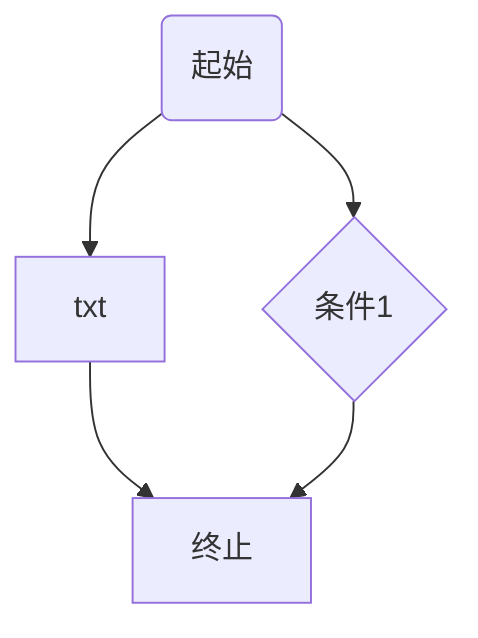

# Markdown基本语法
# 一、标题的使用
# 一级标题
## 二级标题
### 三级标题
#### 四级标题
##### 五级标题
###### 六级标题（最多支持六级标题）  

# 二、段落格式字体格式
## 换行方式
1.末尾加两个空格  
第一行  
第二行  
2.使用空行来换行  
效果：段落之间隔开  
段落1

段落2
## 字体
方法：使用*或者_  
*斜体文本*  
_斜体文本_  
**加粗文本**  
__加粗文本__  
***粗斜体文本***  
___粗斜体文本___
## 分割线
可以在一行中用三个以上的星号、减号、底线来建立一个分隔线，行内不能有其他东西。你也可以在星号或是减号中间插入空格。下面每种写法都可以建立分隔线：
***
* * *
******
---
- - -
## 删除线
需要在文字的两端加上两个波浪线 ~~ 即可
~~删除线~~
## 下划线
下划线可以通过 HTML 的 \<u> 标签来实现：  
<u>带下划线文本</u>

# 三、代码块
## 段落上的代码
`printf()`函数
## 代码区块
方法：``` 包裹一段代码，可指定一种语言（也可以不指定）

```c {.line-numbers}
int main()
{
    return 0;
}
```
# 四、序列表
## 无序列表
无序列表使用星号(*)、加号(+)或是减号(-)作为列表标记，这些标记后面要添加一个空格，然后再填写内容.
```markdown
* 第一项
* 第二项

+ 第一项
+ 第二项

- 第一项
- 第二项
```
* 第一项
* 第二项

+ 第一项
+ 第二项

- 第一项
- 第二项
## 有序列表
有序列表使用数字并加上 . 号来表示
```markdown
1. 第一项
2. 第二项
3. 第三项
```
1. 第一项
2. 第二项
## 列表嵌套
子列前添加4空格或制表符
```markdown
1. 第一项
    * 元素1
    * 元素2
2. 第二项
    * 元素1
    * 元素2
```
1. 第一项
    * 元素1
        + 子元素
    * 元素2
2. 第二项
    - 元素1
    - 元素2
# 五、超链接
## 网址
```markdown
[链接](https://baidu.com)

<https://baidu.com>
```
这是一个百度链接[baidu](https://baidu.com)
## 图片
```markdown


```

# 六、区块引用
Markdown 区块引用是在段落开头使用 > 符号 ，然后后面紧跟一个空格符号：
```markdown
> 区块引用
```
## 区块嵌套
一个 > 符号是最外层，两个 > 符号是第一层嵌套，以此类推：
```markdown
> 最外层
> > 一层嵌套
> > > 二层嵌套
```
效果如下：
> 最外层
>> 一层嵌套
>>> 二层嵌套
## 区块中使用列表
```markdown
> 区块中使用列表
> 1. 第一项
> 2. 第二项
> + 第一项
> + 第二项
```
效果如下：
> 区块中使用列表
> 1. 第一项
> 2. 第二项
> + 第一项
> + 第二项
## 列表中使用区块
```markdown
* 第一项
    > 区块1
* 第二项
    > 区块2
```
效果如下：
* 第一项
    > 区块1
* 第二项
    > 区块2

# 七、表格
Markdown 制作表格使用 | 来分隔不同的单元格，使用 - 来分隔表头和其他行  
格式：
```markdown
| 表头 | 表头 |
| ---- | ---- |
| 单元格 | 单元格 |
| 单元格 | 单元格 |
```
效果如下：
|表头1|表头2|
|---  |--- |
|单元格|单元格|
|单元格|单元格|
## 设置对齐方式
```markdown
-: 右对齐  
:- 左对齐  
:-: 居中对齐  
```


# 十、其他
## 转义
Markdown 使用了很多特殊符号来表示特定的意义，如果需要显示特定的符号则需要使用转义字符，Markdown 使用反斜杠转义特殊字符   

## 使用HTML元素
Markdown可以直接在文档里面用 HTML 撰写。
目前支持的 HTML 元素有：\<kbd> \<b> \<i> \<em> \<sup> \<sub> \<br>等 。(注意加了转义符反斜线'\\')  

## 颜色字体
设置颜色字体格式如下：
```markdown
<font color="颜色">文本内容

<font face="黑体">我是黑体字</font>
<font face="微软雅黑">我是微软雅黑</font>
<font face="STCAIYUN">我是华文彩云</font>
<font color=red>我是红色</font>
<font color=#008000>我是绿色</font>
<font color=Blue>我是蓝色</font>
<font size=5>我是尺寸</font>
<font face="黑体" color=green size=5>我是黑体，绿色，尺寸为5</font>

```
一般不使用

## 背景色设置
```markdown
<table><tr><td bgcolor=orange> 背景色是 1 orange</td></tr></table>
<table><tr><td bgcolor= BlueViolet > 背景色2 BlueViolet </td></tr></table>
```
一般不使用
## 流程图
> 流程图在Markdown中的的表现形式就是代码块，代码块语言标记为mermaid。主要内容大体分为：方向、节点、节点间的连接关系，下面就围绕这三个点来整理。
mermaid支持流程图、甘特图和时序图，但是经过这次尝试，结论就是画图的话还是使用专业的画图工具，这个只能作为一种简单选项用在简单场景下。所以这里就只总结一下流程图的使用，其它两种就没必要了，不是怎么好用。



## 数学公式
默认下的分隔符：  
\$...$      靠左显示  
\$\$...$$   居中显示  
```markdown
$f(x) = sin(x) + 12$
$$f(x) = sin(x) + 12$$
$$f(x)=ax^2 + bx_1+c+\Delta+\sqrt(2ab)$$
```
效果如下：  
$f(x) = sin(x) + 12$
$$f(x) = sin(x) + 12$$
$$f(x)=ax^2 + bx_1+c+\Delta+\sqrt(2ab)$$